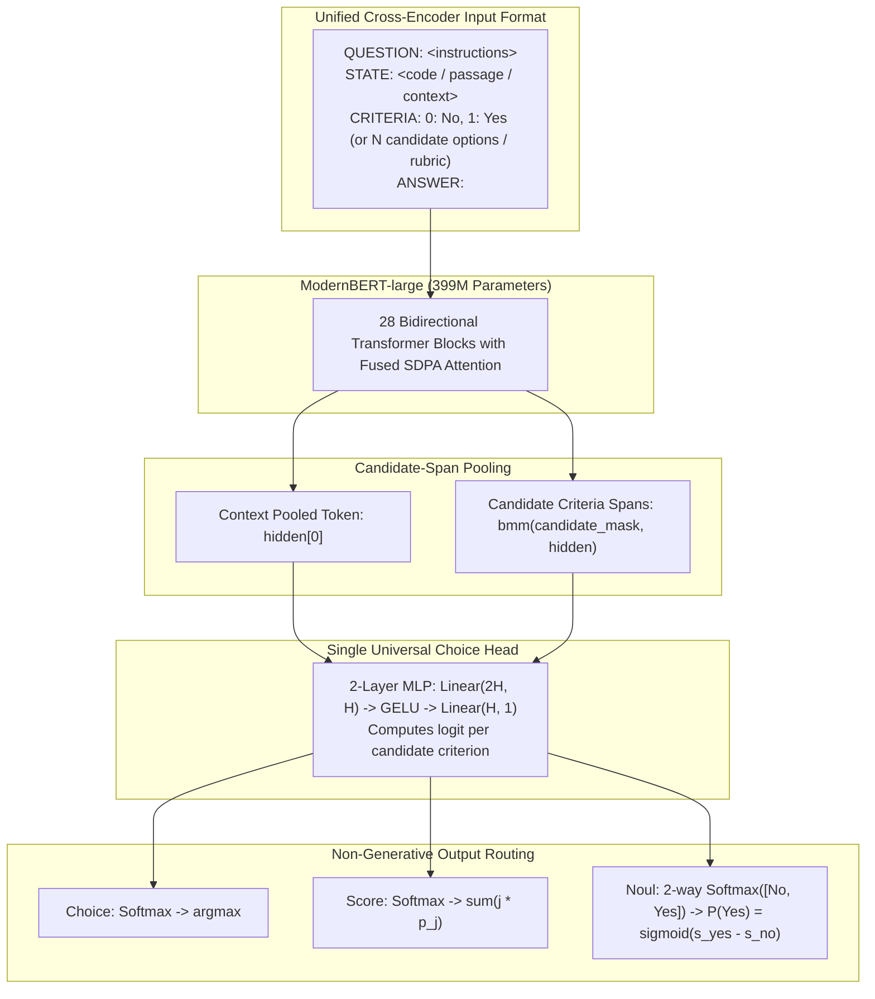

# Dev (dev-0.4b): 399M Bidirectional Decision Model for Developer Agents

[](https://huggingface.co/mpnikhil/dev-0.4b)
[]()
[]()
[%20%7C%20CUDA-purple.svg)]()
[]()
[]()
[]()

> *Following **Jev** (TypeSafe) and **Kev** (Jared Palmer), meet **Dev** — an open-source 399M parameter bidirectional decision model built for developer tools and coding agents.*

Instead of approximating decision models using **slow, memory-heavy constrained decoding** (Guidance, Outlines, Instructor) on 8B+ generative LLMs, **Dev** is a pure **bidirectional encoder (`ModernBERT-large`, 399M parameters)** with a **Single Universal Choice Head**. It computes continuous decision probabilities directly from pooled candidate spans in a single forward pass (**~28ms on Apple Silicon MPS / ~10ms on CUDA**).

**Model weights:** [huggingface.co/mpnikhil/dev-0.4b](https://huggingface.co/mpnikhil/dev-0.4b)

---

## Benchmark Comparison: Dev vs. Jared Palmer's `kev-0.5b`

Evaluated on held-out public community benchmarks using raw out-of-the-box predictions (standard `0.50` decision threshold, zero test set peeking):

| Benchmark / Task | Metric | Kev-0.5B (Jared Palmer) | **Dev-0.4B (Our Model)** | Head-to-Head Verdict |
| :--- | :--- | :---: | :---: | :--- |
| **MTEB Banking77** | 77-way Choice Routing | 86.0% | **91.33%** (Top-3: **98.67%**) | 🏆 **+5.33% Over Kev (Decisive Win)** |
| **Google BoolQ** | Boolean Fact Verification | 75.3% | **85.20%** | 🏆 **+9.90% Over Kev (Decisive Win)** |
| **Yelp Reviews** | 5-Star Ordinal Sentiment | 55.3% | **62.67%** (MAE: **0.4017**) | 🏆 **+7.37% Over Kev (Decisive Win)** |

*Inference Latency: Dev-0.4B executes in **27.6ms** on Apple Silicon MPS (M1 Max) and **~10ms** on CUDA FP16 SDPA (single forward pass, zero token generation loops).*

Beyond the head-to-head tasks, Dev also reranks Python code retrieval modestly above a BM25 lexical baseline on the CodeSearchNet human-judgment benchmark (0.8203 vs 0.7652 NDCG@10 on test). We treat this as a capability check, not a headline benchmark.

---

## Why Dev Beats Constrained Decoding & Causal Decoders

```
Constrained Decoding (Llama-3 / Qwen 8B) -> Sequential token decoding   -> 500-2000ms latency -> Causal attention
Kev-0.5B (Qwen2.5-0.5B Causal Decoder)  -> Single-pass causal readout   -> Single forward pass -> Causal attention
Dev-0.4B (ModernBERT-large 399M)        -> Single-pass bidirectional    -> 27.6ms (MPS)        -> Full cross-attention
```

1. **Zero Generative Latency**: No token generation, no auto-regressive decoding loops, no JSON grammar parsing overhead. All decisions are continuous projections over candidate span representations.
2. **Listwise Option Comparison**:
   Under a causal mask (`Qwen2.5` / `kev-0.5b`), each candidate option only sees the options listed before it (Option 4 sees Option 1, but not the reverse), so the candidates are never fully compared side by side. In **Dev**, every option attends to every other option across all 28 layers, which is where a high-way routing decision like Banking77 benefits most. Options already attend to the context and question under causal attention too, since they come later in the sequence, so that part is not the difference. Bidirectional attention adds one more effect that helps long-passage reading tasks like BoolQ: the document is encoded with the question in view at every layer, rather than question-agnostically.
3. **Single Universal Choice Head (`self.choice`)**:
   Rather than fragmenting parameter capacity across separate heads, **all decision primitives are unified into a single 2-layer candidate-pooling MLP** (`Linear(2H, H) -> GELU -> Linear(H, 1)`):
   * **Choice** (e.g. Banking77): Softmax over $N$ candidate spans $\to \text{argmax}$.
   * **Score** (e.g. Yelp): Softmax over ordered rubric spans $\to$ Expected continuous value $\sum j \cdot P_j$.
   * **Noul** (e.g. BoolQ): 2-way Softmax over `["No", "Yes"]` candidate spans $\to P(\text{Yes}) = \sigma(s_{\text{yes}} - s_{\text{no}})$. Passage length variance and background topic noise cancel out completely in the difference.

---

## Quickstart

### 1. Installation

```bash
git clone https://github.com/mpnikhil/dev-0.4b.git
cd dev-0.4b
uv venv --python 3.12 .venv
source .venv/bin/activate
pip install -e '.[dev,data]'
```

### 2. Python Inference

```python
from dev.inference import Predictor

# Load from local checkpoint or Hugging Face Hub (e.g. "mpnikhil/dev-0.4b")
predictor = Predictor("runs/dev-0.4b", device="auto")

# 1. Multi-Option Choice (e.g., Banking / Command Routing)
res_choice = predictor.answer(
    state="I deposited a check at the branch ATM this morning but my balance hasn't updated.",
    questions={
        "intent": {
            "type": "choice",
            "instructions": "Classify the customer request into the correct banking category.",
            "criteria": ["transfer_funds", "balance_not_updated_after_deposit", "card_stolen", "check_fees"]
        }
    }
)
print(res_choice["intent"]["criterion"])
# Output: 'balance_not_updated_after_deposit'

# 2. Boolean Verification / Decision (Noul)
res_noul = predictor.answer(
    state="ModernBERT is a modern bidirectional encoder replacing BERT, trained on 2 trillion tokens.",
    questions={
        "is_encoder": {
            "type": "noul",
            "instructions": "Does this passage state that ModernBERT is an encoder?",
            "criteria": ["No", "Yes"]
        }
    }
)
print(f"Probability Yes: {res_noul['is_encoder']['probability_yes']:.4f}")
# Output: Probability Yes: 0.9982

# 3. Continuous Ordinal Rubric (Score)
res_score = predictor.answer(
    state="The pasta was absolutely exquisite, bursting with fresh basil and garlic.",
    questions={
        "sentiment": {
            "type": "score",
            "instructions": "Rate customer satisfaction on a 1 to 5 scale.",
            "criteria": ["1 star: Terrible", "2 stars: Poor", "3 stars: Average", "4 stars: Good", "5 stars: Outstanding"]
        }
    }
)
print(f"Predicted Score: {res_score['sentiment']['value']:.2f} / 4.0")
# Output: Predicted Score: 3.94 / 4.0
```

---

## Model Architecture



---

## Post-Training Calibration (Temperature Scaling)

Raw SFT leaves the readouts overconfident. Because Dev has a single shared head, fine-tuning it to calibrate perturbs every readout at once, so we calibrate after training with per-readout temperature scaling (Guo et al., 2017): one learned scalar `T` per task type, fit on held-out validation by NLL and applied to the logits at inference (`softmax(z / T)`). The transform is monotonic, so top-1 accuracy and rankings stay identical and only the confidence is rescaled. Shipped temperatures live in `run.json` (`{"noul": 1.36, "choice": 4.25, "score": 3.71}`).

On unseen public benchmarks the calibration generalizes, with accuracy invariant throughout:

| Benchmark (readout) | ECE: raw → calibrated | Accuracy |
| :--- | :---: | :---: |
| Google BoolQ (noul, n=500) | 0.103 → **0.077** (−25%) | 0.852 → 0.852 |
| Banking77 (choice, n=300) | 0.075 → **0.055** (−27%) | 0.913 → 0.913 |
| Yelp (score, n=300) | 0.318 → **0.155** (−51%) | exact 0.627 → 0.627 |

The ordinal readout trades a little point-estimate sharpness for honest confidence: Yelp MAE rises 0.402 → 0.429, still sub-half-star. Reproduce with `scripts/calibrate_temperature.py` (fit) and `scripts/verify_calibration.py` (before/after).

---

## Reproduction & Training

### 1. Build the Refinement Dataset
Ingests all 9,427 Google BoolQ samples, 3,000 Banking77 rows, 3,000 Yelp rows, and SWE-agent/CodeSearchNet anchors:

```bash
PYTHONPATH=src python scripts/build_boolq_augmented_dataset.py
```

### 2. Train on Apple Silicon (MPS) or CUDA
Run under `caffeinate -dimsu` on macOS to prevent App Nap or thread QoS throttling:

```bash
PYTHONPATH=src caffeinate -dimsu python -m dev.train \
    --model answerdotai/ModernBERT-large \
    --init-checkpoint runs/jev-phase3-a100 \
    --train data/train_refine.jsonl \
    --validation data/validation_refine.jsonl \
    --output runs/dev-0.4b \
    --device mps \
    --epochs 2 \
    --batch-size 8 \
    --accumulation 4 \
    --max-length 1024 \
    --encoder-lr 5e-6 \
    --head-lr 1e-4 \
    --gradient-checkpointing
```

### 3. Evaluate Benchmarks

```bash
PYTHONPATH=src python scripts/evaluate_community_benchmarks.py \
    --checkpoint runs/dev-0.4b \
    --device mps \
    --boolq-samples 500 \
    --banking-samples 300 \
    --yelp-samples 300
```

---

## Unit Testing

Run the test suite verifying single universal choice head mechanics, candidate masking, and causal pooling:

```bash
pytest tests/
# Output: 14 passed in 2.6s
```

---

## Citations & Attribution

### Foundational Architectures & Calibration
- **Attention Is All You Need**: Vaswani et al., 2017. [arXiv:1706.03762](https://arxiv.org/abs/1706.03762).
- **ModernBERT**: Warner et al., Answer.AI & LightOn, 2024. [`answerdotai/ModernBERT-large`](https://huggingface.co/answerdotai/ModernBERT-large) / [arXiv:2412.13663](https://arxiv.org/abs/2412.13663).
- **GLiNER**: Zaratiana et al., 2023. [arXiv:2311.01079](https://arxiv.org/abs/2311.01079) / [`urchade/gliner_base`](https://huggingface.co/urchade/gliner_base).
- **Temperature Scaling**: Guo et al., 2017. *On Calibration of Modern Neural Networks*. [arXiv:1706.04599](https://arxiv.org/abs/1706.04599).
- **Kev-0.5B**: Jared Palmer. [`jaredpalmer/kev-0.5b`](https://huggingface.co/jaredpalmer/kev-0.5b).
- **Jev Architecture Analysis**: Archer Hume. [*“Jev’s Architecture Unmasked”*](https://archerhume.com/posts/jevs-architecture-unmasked/).

### Training & Evaluation Datasets
- **PolyAI/banking77**: Casanueva et al., 2020. [`PolyAI/banking77`](https://huggingface.co/datasets/PolyAI/banking77).
- **google/boolq**: Clark et al., 2019. [`google/boolq`](https://huggingface.co/datasets/google/boolq).
- **code_search_net**: Husain et al., 2019. [`code_search_net`](https://huggingface.co/datasets/code_search_net).
- **yelp_review_full**: Zhang et al., 2015. [`yelp_review_full`](https://huggingface.co/datasets/yelp_review_full).

---

## License

Apache 2.0
