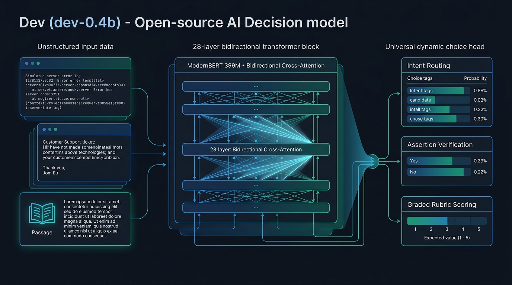
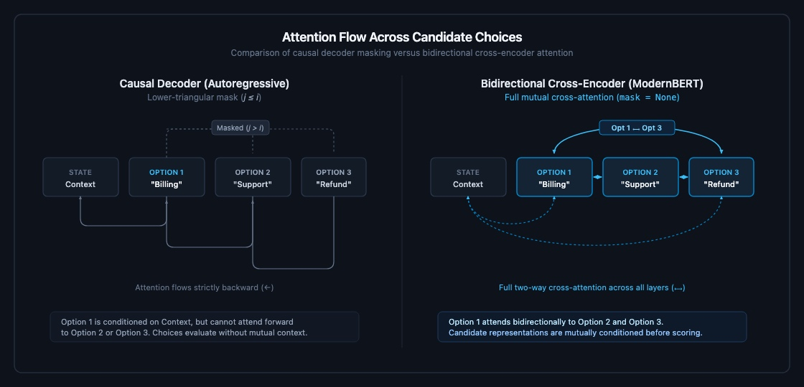
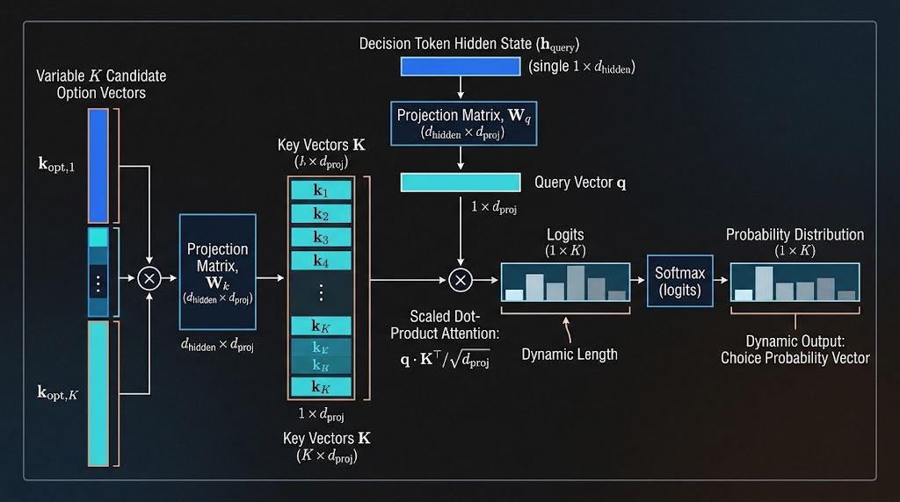

# Dev (dev-0.4b): What If Jev Is a Bidirectional Cross-Encoder?

*An exploration of non-generative decision models for unstructured input, built on ModernBERT.*

---



TypeSafe’s release of **Jev** last week sparked one of the most interesting architecture discussions of the year. Instead of paying an 8B or 70B generative LLM to run autoregressive decoding loops just to emit a JSON boolean or category label, Jev framed decision-making as direct, non-generative classification over caller-defined criteria.

Shortly after, Archer Hume published [“Jev’s Architecture Unmasked”](https://archerhume.com/posts/jevs-architecture-unmasked/), reverse-engineering Jev across 10,000 API calls and establishing key structural properties: shared state encoding, isolated question branches, and direct outcome-trained probability readouts without text generation. 

Building directly on Archer’s findings, Jared Palmer released [**Kev-0.5B**](https://huggingface.co/jaredpalmer/kev-0.5b), an open-source reproduction. Jared demonstrated that you don't need autoregressive token generation at all—Kev uses a frozen `Qwen2.5-0.5B` causal backbone with a 9.3M trainable LoRA adapter and a pointer readout head to score decisions in a single forward pass.

This cleanly separates the architectural landscape:
1. **The Industry Status Quo:** Prompting 8B+ causal LLMs with constrained decoding (Outlines/Guidance) to generate tokens step-by-step—paying hundreds of milliseconds of latency for simple classification tasks.
2. **Kev-0.5B (Jared Palmer):** Proved that single-pass, non-generative readouts work on compact models, using a causal `Qwen2.5-0.5B` backbone with a LoRA adapter.
3. **Dev-0.4B (Our Exploration):** Takes the next architectural step: **what happens if the backbone isn't a causal decoder with lower-triangular attention masks at all, but a native bidirectional cross-encoder (`ModernBERT-large`)?**

The genuine contest between Dev and Kev is not generation vs. classification—both models avoid token generation. The real test is: **how much does a native bidirectional backbone (and full multi-task fine-tuning) outperform a causal decoder when evaluating candidate options against complex context?**

---

## 1. The Core Intuition: Causal Decoders vs. Bidirectional Cross-Encoders

When you use an LLM as a classifier for unstructured input, you typically provide:
1. An unstructured **state** (a 300-line stack trace, a customer email, a raw code diff, or a retrieved passage).
2. A **question** or instruction (*"Which team owns this ticket?"* or *"Did this test pass?"*).
3. A set of **candidate options** (categories, tools, or `["No", "Yes"]`).

### Right Tool for the Right Job: Generation vs. Classification

To be clear: causal autoregressive decoding is the indispensable engine of generative AI. Serious agentic workflows that require multi-step reasoning, planning, reflection, or code synthesis fundamentally require Chain-of-Thought (CoT) token generation. For those tasks, causal masking (token j ≤ i) is mathematically necessary so that future tokens cannot leak into the past.

However, transforming messy, unstructured data into structured classifications is a fundamentally different problem. In triage pipelines, log monitoring, ticket routing, and assertion checks, you already have the complete document (a 300-line stack trace, a customer email, a raw code diff) and a finite set of candidate choices. You do not need the model to generate words—you need it to score and rank candidates. Using an 8B+ generative LLM with constrained decoding (Outlines/Guidance) token by token just to emit an enum or boolean is massive overkill.

### What Attention Does a Decision Actually Need?

In both models a single readout token soaks up information from the whole prompt: a causal decoder reads it off the final token, and a bidirectional encoder reads it off a token that has attended to the entire sequence. So on this there is a tie. Two other things are not:

**The options can't compare.** Listed one after another, a causal mask lets Option 4 see Option 1 but not the reverse, so the candidates are never weighed as a set. Bidirectional lets every option see every other one, and the more options you list, the more that matters.

**The document is read question and options-blind.** The question and the options come after the document, so under a causal mask the document never attends to the question and options, the question never attends to the options, and they all meet only at the final token. A bidirectional cross-encoder removes that constraint, and every part attends to every other part at every one of its 28 layers.

You could hand-roll a custom mask to fix the first, for zero FLOP savings since the GPU runs the same matmuls. The second is harder to bolt on, because it comes from the whole stack being bidirectional. `ModernBERT-large` gives you both out of the box.



---

## 2. Architecture: Three Tasks, One Single Choice Head

TypeSafe's Jev framed decision-making around three common tasks: **classifying into categories**, **answering yes/no**, and **rating on a 1–5 or 1–10 scale**. 

On the surface, these look like three fundamentally different tasks that would require three separate output heads. 

In reality, **all three tasks are fundamentally classification**:
- Answering **yes/no** is simply classification over two choices: `["No", "Yes"]`.
- Routing a ticket is classification over N categories.
- Rating on a **1–5 scale** is classification over ordered levels (`["1 star", ..., "5 stars"]`), where the final score is just the expected value.

Because all three are classification, we don't need three separate heads—we only need **a single output head**.

### The GLiNER Mechanism: Making Choices Dynamic

The limitation of a traditional classification head is that categories are hardcoded into the network weights—if you want to classify new categories, you have to retrain.

This is where we borrow the elegant mechanism from **GLiNER**: choices don't need to be hardcoded into neural network layers. Instead, candidate options are written as natural language text directly inside the prompt.

By combining these two ideas—unifying the tasks into classification, and using the GLiNER mechanism for dynamic choices—our single head evaluates whatever options you write in the prompt:

1. **Classification into categories:**
   Write any list of categories in the prompt (e.g. `["Billing", "Tech Support", "Cancellations"]`). The choice head evaluates all options in parallel, and Softmax gives you the probability distribution across them.

2. **Yes / No:**
   Pass `["No", "Yes"]`. Both options pass through the exact same head, producing naturally symmetric, calibrated probabilities.

3. **Rating on a 1–5 or 1–10 scale:**
   Pass the ordered levels (e.g. `["1 star", "2 stars", ..., "5 stars"]`). The head outputs a probability distribution across the levels, and the final score is the expected value:
   `Expected Score = Σ (j × p_j)` (for j = 0 to K-1)

---

## 3. Engineering Notes: The Unified Dynamic Readout Mechanism

### The Core Idea: Direct Decision Without Token Generation

Today, we extract structured decisions from generative LLMs in two ways:
1. **Unconstrained text parsing:** Prompting the LLM, waiting for it to stream text, and praying it outputs valid JSON that can be parsed with regex or Pydantic.
2. **Grammar-constrained decoding (Outlines, Guidance, vLLM JSON mode):** Running a finite-state machine that enforces a strict JSON grammar at each step, masking out 99.9% of the 150k-token vocabulary so only grammatically valid schema tokens can be selected.

While grammar constraints guarantee valid JSON, we are still forcing an 8B+ causal model through a multi-step autoregressive loop—reading and appending to memory-bandwidth-heavy KV-caches and projecting over massive 150k vocabularies at every token step—just to select an option that was already in the prompt.

Dev bypasses token generation entirely:
- In a single forward pass, ModernBERT contextualizes the document and all candidate choices together.
- We take the document summary representation and the representations of each candidate choice.
- A lightweight scoring head compares each choice against the document and outputs a score.
- Softmax over those scores yields the answer directly—measuring **27.6ms on an Apple Silicon M1 Max (MPS)** and ~10ms on CUDA.

### Why the Head Scales Dynamically to Any Option Count

A standard classification head (`Linear(hidden_dim, num_classes)`) has a fixed number of output neurons baked into its weights.

By framing choices as keys, the readout head uses two tiny, fixed projection matrices (`W_q` and `W_k`) that never change, regardless of how many options exist:
- The candidate count `K` is just the row dimension of the options matrix `H_opts`.
- Whether `K = 2`, `K = 5`, or `K = 77`, the matrix multiplication dynamically outputs a `1 × K` logit vector and normalizes across strictly those `K` slots.



---

### Worked Numerical Simulation: One Set of Weights, Variable Choices

To trace the matrix math, consider a miniature system:
- Transformer hidden dimension (`d`): 4
- Readout projection dimension (`d_proj`): 2

```text
Fixed learned projection weights (4x2):

Query Projection (W_q):
  [  0.5, -0.2 ]
  [  0.8,  0.1 ]
  [ -0.3,  0.6 ]
  [  0.1, -0.4 ]

Key Projection (W_k):
  [  0.6, -0.1 ]
  [  0.4,  0.5 ]
  [ -0.2,  0.3 ]
  [  0.0, -0.5 ]
```

Assuming the decision token produces hidden state `h_D = [1.2, 0.4, -0.2, -0.8]`:
Projecting `h_D` through `W_q` yields query vector `q` (1x2):
```text
q = h_D @ W_q = [0.90, 0.00]
```

#### Step 1: Base 3-Way Choice (K = 3)
Given three candidate states (`HIGH`, `MED`, `LOW`), projecting through `W_k` gives our key matrix `K_opts` (3x2):

```text
Candidate Hidden States (H_opts, 3x4):
  HIGH:  [  1.0,  0.5, -0.1, -0.5 ]
  MED:   [  0.2,  0.8,  0.4, -0.2 ]
  LOW:   [ -0.5, -0.2,  0.9,  0.3 ]

Key Matrix (K_opts = H_opts @ W_k, 3x2):
  HIGH:  [  0.82,  0.37 ]
  MED:   [  0.36,  0.60 ]
  LOW:   [ -0.56,  0.07 ]
```

Compute the scaled inner product `Z = (q @ K_opts.T) / sqrt(2)`:
```text
Z = [0.5218, 0.2291, -0.3564]
```

Running Softmax over those 3 logits yields the choice probabilities:
```text
p = softmax(Z) = [0.46, 0.35, 0.19]
Outcome: HIGH wins with 46% probability.
```

#### Step 2: Flexing Dynamically to 4 Choices (K = 4)
Without modifying `W_q` or `W_k`, introduce a 4th candidate (`CRITICAL`) with hidden vector `h_CRIT = [1.5, 0.2, 0.0, -0.8]`.

Projecting through `W_k` simply adds a 4th row to `K_opts`:
```text
Expanded Key Matrix (K_opts, 4x2):
  HIGH:      [  0.82,  0.37 ]
  MED:       [  0.36,  0.60 ]
  LOW:       [ -0.56,  0.07 ]
  CRITICAL:  [  0.98,  0.35 ]  # 4th choice
```

The inner product effortlessly expands to dimension 1x4:
```text
Z = (q @ K_opts.T) / sqrt(2)
  = [0.5218, 0.2291, -0.3564, 0.6237]
```

The 4-way Softmax re-normalizes across the expanded candidate space:
```text
p = softmax(Z) = [0.31, 0.23, 0.13, 0.34]
Outcome: CRITICAL takes the lead with 34%!
```

---

### How Every Output Type Collapses Into This One Operation

The model does not have separate architectures for booleans, ratings, and enums. It executes the exact same dot-product operation every time; only the number of options (`K`) and the downstream interpretation change:

```text
Three Output Modes, One Operation:

1. Noul (Boolean, K = 2):
   Choices: ["yes", "no"]
   Logits:  q @ K_opts.T / sqrt(2)  (1x2)
   Output:  [0.93, 0.07] -> P(yes) = 0.93

2. Choice (Categorical, K = 3):
   Choices: ["refund", "exchange", "reject"]
   Logits:  q @ K_opts.T / sqrt(2)  (1x3)
   Output:  [0.10, 0.85, 0.05] -> "exchange"

3. Score (Ordinal, K = 5):
   Choices: ["1★", "2★", "3★", "4★", "5★"]
   Logits:  q @ K_opts.T / sqrt(2)  (1x5)
   Output:  [0.01, 0.04, 0.20, 0.65, 0.10]
   Value:   Expected Score = 2.79 / 4.0
```

- **Noul (Boolean)**: Prompted with 2 choices (`["yes", "no"]`). The first softmax entry `p_yes` is emitted directly as the calibrated probability that the assertion is true.
- **Choice (Categorical Enum)**: Prompted with anywhere from 2 to 255 arbitrary string candidates (`K between 2 and 255`). The index with the highest probability (argmax) supplies the winning label, and its softmax value provides the confidence score.
- **Score (Ordinal / Rating)**: Prompted with 2 to 10 ordered criteria levels (`K between 2 and 10`). Instead of unpredictable continuous regression, the scalar value is calculated as the expected value (`μ = Σ (i × p_i)`). Its confidence is calculated from the **normalized variance** (`1 - Var / Var_max`): measuring how tightly the probability mass clusters around the expected value `μ` rather than being dispersed across conflicting extremes.

A single forward pass and one matrix dot-product handle every structured data type with bounded, calibrated probabilities and zero text generation.

---

## 4. Benchmark Results: Dev vs. Kev-0.5B and Baselines

We trained Dev locally on an Apple Silicon M1 Max in a single day across a multi-task dataset combining intent classification (Banking77), reading comprehension (Google BoolQ), code retrieval (CodeSearchNet Python), and sentiment scoring (Yelp). 

Here is how Dev compares against Jared Palmer’s `kev-0.5b` and baseline benchmarks using raw, out-of-the-box predictions (standard `0.50` threshold, zero post-hoc calibration). 

*(Note on architectures: Kev-0.5B is a 494M parameter model using a frozen Qwen2.5-0.5B causal backbone + 9.3M trainable LoRA pointer head. Neither model generates text—this benchmark directly isolates the impact of a native bidirectional encoder backbone vs. a causal decoder backbone).*


```text
Task          Kev-0.5B   Dev-0.4B      Win
─────────────────────────────────────────────
Banking77      86.0%      91.33%    +5.33% 🏆
BoolQ          75.3%      85.20%    +9.90% 🏆
Yelp (5★)      55.3%      62.67%    +7.37% 🏆
```

*Details: Banking77 reached **98.67%** Top-3 recall. Yelp continuous score achieved **0.4017** MAE. Dev-0.4B latency is **27.6ms** on Apple Silicon MPS (M1 Max) and **~10ms** on CUDA FP16 SDPA.*

### Observations:

- **Where Bidirectional Cross-Attention Crushes Causal Blinders (BoolQ)**:
  On Google BoolQ reading comprehension, Dev reached **85.20%** compared to Kev's **75.3%**—a massive **+9.9 point win**. In BoolQ, the model must verify a claim against a long reading passage. Under Kev's causal Qwen decoder, the passage is processed with zero knowledge of the question being asked. In Dev, every token in the passage attends bidirectionally to the question across all 28 layers.

- **Nuanced Multi-Choice Routing (Banking77)**:
  On 77-way intent classification, Dev achieved **91.33% top-1 accuracy** (+5.33% over Kev) and **98.67% top-3 recall**. When discriminating among 77 nuanced categories, bidirectional interaction across the full input and candidate set allows the options to compete and contrast mutually, rather than suffering from causal position bias.

- **5-Star Graded Scoring (Yelp Reviews)**:
  On 5-level Yelp rating, Dev achieved **62.67% exact top-1 accuracy** (+7.37% over Kev's 55.3%) alongside a continuous **MAE of 0.4017**. Because the single choice head outputs probabilities across the scale levels, taking the expected value provides continuous sub-half-star scoring while simultaneously winning on exact classification.

- **Grounding on Real Code (CodeSearchNet)**:
  We also checked that Dev handles real code, not just prose. On the official CodeSearchNet Python human-judgment benchmark (86 queries across dev and test), it scores 0.8203 NDCG@10 on test and 0.8054 on dev, above the BM25 lexical baseline (0.7652 and 0.7848). BM25 is a classical keyword baseline rather than a modern neural retriever, so we read this as evidence that the model handles code syntax such as decorators and multi-line functions, not as a retrieval state-of-the-art claim.

### Conscious Early Stopping at Epoch 2:
During multi-task training, we monitored validation across all four benchmarks. By Epoch 3, while training loss continued to drop, code retrieval performance softened slightly as the model adapted to conversational phrasing. We stopped SFT at **Epoch 2** to preserve balanced representations across both code and natural language text before moving to post-training calibration.

---

## 5. Post-Training Calibration: A Temperature-Scaling Alignment Stage

In generative LLM training, Supervised Fine-Tuning (SFT) establishes task formatting, while post-training alignment (RLHF/DPO) makes the outputs reliable. A decision model needs an analogous stage, but for a narrower reason: we want the probability after softmax to reflect genuine confidence—so that P(yes) = 0.85 actually means 85 out of 100 such decisions are correct.

### Where SFT Leaves the Model

Cross-Entropy loss (-log p) separates classes well, but its logarithmic tail rewards pushing logits toward extreme values (±infinity), which produces overconfidence. Measured on held-out validation data, the three readouts are miscalibrated to very *different* degrees:

```text
Readout    Samples  Conf   Acc     ECE
─────────────────────────────────────────────
Boolean     1,075   0.98  97.0%   0.016 (good)
Choice      1,435   0.97  78.2%   0.189 (over)
Score       1,775   0.88  54.5%   0.332 (over)
```

The boolean readout comes out of SFT essentially calibrated; the categorical and ordinal readouts are significantly overconfident.

### What Didn't Work: Fine-Tuning the Head

Our first attempt froze the 395M encoder and fine-tuned only the 2.1M choice head for 200 steps under Brier loss. The full metrics (`runs/dev-0.4b-calibrated/run.json`) show it barely moved: boolean Brier `0.0292 → 0.0288` (~1.6%), with choice and score Brier flat-to-slightly-worse.

The reason is structural, and it follows directly from the single-head design in Section 3. Because all three readouts share **one** set of weights, any gradient that softens one readout perturbs the others—and Brier's gradient, 2(p - y) * p(1 - p), vanishes exactly at the confident predictions we most need to soften. Head fine-tuning is the wrong tool for calibration.

### What Worked: Per-Readout Temperature Scaling

Calibration only rescales confidence; it does not change any decision, so it needs very little capacity. Temperature scaling (Guo et al., 2017) does this with a single scalar T applied to the logits before the softmax, p = softmax(z / T), fit on held-out data by minimizing NLL. One scalar cannot overfit, and because the transform is monotonic it leaves every argmax and ranking in place, so top-1 accuracy is identical before and after.

Dev has one head, so instead of adding heads we fit one temperature per readout type and apply it at inference from the declared task. Three are needed because a 2-way contrast, a 77-way softmax, and a 5-level ordinal sit at different logit scales even though they come from the same weights. We fit and ship all three. On the held-out validation set where they were fit (equal-mass ECE):

```text
Readout    Fitted T   ECE (raw→cal)   Accuracy
──────────────────────────────────────────────
Boolean     T=1.36    0.016 (low)      96.7%
Choice      T=4.25    0.189 → 0.083    78.2%
Score       T=3.71    0.332 → 0.117    54.5%
```

*(Validation accuracies are on the multi-task mix, not the single-benchmark numbers in Section 4.)*

Choice and score come out of SFT badly overconfident, and their ECE falls by half or more. Boolean looks already calibrated on this set (0.016), which first suggested leaving it at T=1. The external benchmarks changed that picture. The same shipped temperatures, measured on unseen data, show whether the calibration holds up:

```text
Benchmark      ECE (raw → cal)      Accuracy
─────────────────────────────────────────────
BoolQ (bool)   0.103 → 0.077 (-25%)  85.2%
Banking77      0.075 → 0.055 (-27%)  91.3%
Yelp (score)   0.318 → 0.155 (-51%)  62.7%
```

Accuracy is identical before and after on every benchmark, as expected from a monotonic transform. Boolean, which looked calibrated on validation, is overconfident on BoolQ, and its fitted T=1.36 brings its ECE from 0.103 to 0.077. The temperatures are fit on validation and then checked on the held-out benchmarks.

The score readout is the one place calibration costs something. Flattening its distribution pulls the expected value toward the middle of the scale, so Yelp MAE rises from 0.402 to 0.429, still under half a star. ECE and MAE trade off smoothly as T grows; T=3.71 is the value the NLL fit chose, and a smaller T keeps MAE lower for less calibration if an application wants sharper ratings.

Whether calibration touches the answer depends on how the answer is read off the probabilities. Temperature makes the model less sure by spreading probability across the options:

- Yes/No and category answers use the top option. Spreading the probabilities lowers every option but does not change which one is highest, so the decision stays the same and only the confidence moves.
- A rating is the average of the options weighted by their probabilities. Spreading the probabilities out moves that average toward the middle, so the answer itself changes.

Take a 5★ review the model gets right:

```text
Rating:     1★   2★   3★   4★   5★   Avg
─────────────────────────────────────────────
Sharp:     .02  .03  .05  .20  .70  4.5★
Softened:  .06  .09  .15  .30  .40  3.9★
```

The top option stays 5★ in both rows, so a classifier gives the same answer and the same accuracy. The average moves from 4.5 to 3.9 because probability shifted toward the lower stars. Since the rating is that average, the shift shows up as error in the MAE.

### Honest Limits

Temperature scaling is a single post-hoc parameter, stored as metadata and applied at readout rather than folded into the weights. There is no benefit to spreading a one-dimensional rescale across 397M parameters. It lowers average miscalibration but does not fix miscalibration that varies across the confidence range; the choice readout still carries some overconfidence in its middle bins. Removing that needs a higher-capacity calibrator such as vector scaling or isotonic regression, at the cost of the single-parameter simplicity used here.

---

## 6. Quickstart: Fast Inference with Dev

Dev is designed to run locally on CPU, Apple Silicon (MPS), or CUDA with hardware-fused SDPA kernels:

```python
from dev.inference import Predictor

# Loads weights locally on MPS or CUDA
predictor = Predictor("runs/dev-0.4b", device="auto")

# 1. Routing unstructured text to categories
result = predictor.answer(
    state=(
        "Customer cannot log in. "
        "Password reset failing: 550 Mailbox Unavailable."
    ),
    questions={
        "route_ticket": {
            "type": "choice",
            "instructions": "Assign ticket to queue.",
            "criteria": [
                "billing_support",
                "email_infrastructure",
                "account_security",
                "general_inquiry"
            ]
        }
    }
)
print(result["route_ticket"])
# -> {
#      'criterion': 'email_infrastructure',
#      'confidence': 0.9987,
#      'calibrated': True
#    }

# 2. Ordinal Scoring with Normalized Variance
score_result = predictor.answer(
    state=(
        "Pull request refactors cache layer, "
        "adds 14 unit tests, and passes CI."
    ),
    questions={
        "code_quality": {
            "type": "score",
            "instructions": "Rate pull request quality",
            "criteria": [
                "Poor", "Needs Work",
                "Acceptable", "Good", "Excellent"
            ]
        }
    }
)
print(score_result["code_quality"])
# -> {
#      'value': 3.84,        # Expected score (/ 4.0)
#      'variance': 0.14,     # Sharp distribution
#      'confidence': 0.965,  # Normalized certitude
#      'calibrated': True
#    }
```

---

## Conclusion

Jev opened an important door: demonstrating that discrete decision-making in software pipelines shouldn't be bottlenecked by autoregressive text generation.

Archer Hume's analysis gave the community the first detailed blueprint of how direct probability readouts work, and Jared Palmer's Kev-0.5B quickly proved that open-source models could reproduce that behavior.

Our goal with Dev was to explore the next natural question in that lineage: whether a **native bidirectional cross-encoder** could push classification performance even further on complex, unstructured inputs. The results suggest that for high-way choice routing and structured decision tasks, bidirectional cross-attention is an exceptionally strong foundation.

Weights, training harnesses, and evaluation scripts are all open source. We look forward to seeing where the community takes this next.

---

## References & Citations

1. **Vaswani, A., et al. (2017).** *Attention Is All You Need.* Advances in Neural Information Processing Systems (NeurIPS 2017). [arXiv:1706.03762](https://arxiv.org/abs/1706.03762).
2. **Warner, B., et al. (Answer.AI & LightOn, 2024).** *Smarter, Better, Faster, Longer: A Modern Bidirectional Encoder for Fast, Long-Context Representation.* [arXiv:2412.13663](https://arxiv.org/abs/2412.13663) / [`answerdotai/ModernBERT-large`](https://huggingface.co/answerdotai/ModernBERT-large).
3. **Zaratiana, U., et al. (2023).** *GLiNER: Generalist Model for Named Entity Recognition using Bidirectional Transformer.* [arXiv:2311.01079](https://arxiv.org/abs/2311.01079) / [`urchade/gliner_base`](https://huggingface.co/urchade/gliner_base).
4. **Guo, C., Pleiss, G., Sun, Y., & Weinberger, K. Q. (2017).** *On Calibration of Modern Neural Networks.* International Conference on Machine Learning (ICML 2017). [arXiv:1706.04599](https://arxiv.org/abs/1706.04599).
5. **Palmer, J. (2025).** *Kev-0.5B: Open-source decision model built on Qwen2.5-0.5B.* [`jaredpalmer/kev-0.5b`](https://huggingface.co/jaredpalmer/kev-0.5b).
6. **Hume, A. (2025).** *Jev’s Architecture Unmasked.* [archerhume.com](https://archerhume.com/posts/jevs-architecture-unmasked/).
7. **Casanueva, I., et al. (2020).** *Efficient Intent Detection with Dual Sentence Encoders Applications to Banking.* [`PolyAI/banking77`](https://huggingface.co/datasets/PolyAI/banking77).
8. **Clark, C., et al. (2019).** *BoolQ: Exploring the Surprising Difficulty of Natural Yes/No Questions.* [`google/boolq`](https://huggingface.co/datasets/google/boolq).
9. **Husain, H., et al. (2019).** *CodeSearchNet Challenge: Evaluating the State of Semantic Code Search.* [`code_search_net`](https://huggingface.co/datasets/code_search_net).
10. **Zhang, X., Zhao, J., & LeCun, Y. (2015).** *Character-level Convolutional Networks for Text Classification.* [`yelp_review_full`](https://huggingface.co/datasets/yelp_review_full).

